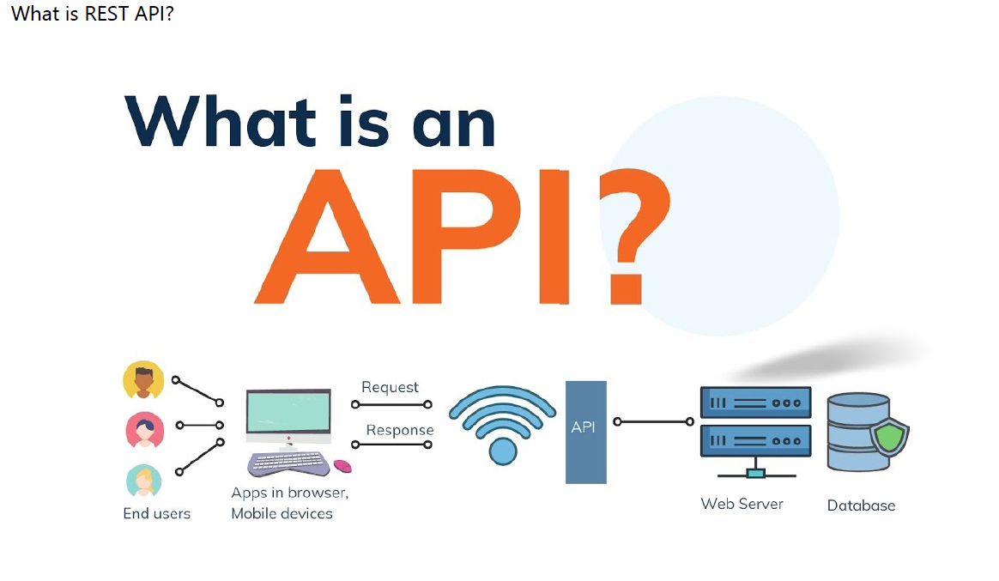
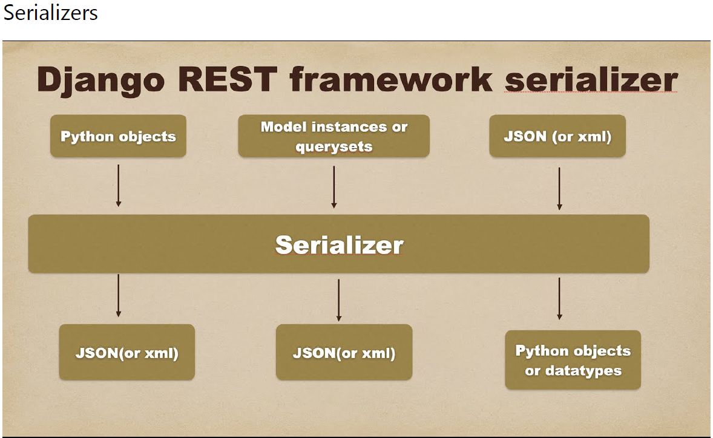

# Django REST Framework

Bu projedeki amacımız Django Rest Framework'u olusturacagımız 5 app ile ozetlemek. 


**app_1 (Serializers)**

- Bu app de views.py dosyasını hazır aldık, bu app de sadece aşağıda belirtilen hususlara değinilmiştir.


- Serializers
     - Serializer class
     - ModelSerializer class
- Custom Validations
- Additional Features
- Relational fields
     - StringRelatedField
     - PrimaryKeyRelatedField
- Serializer Fields
     - read_only
     - write_only
- Nested Serializer





İlgili app içinde serializers.py dosyası oluşturun.

serializers.Serializer: ile models.py da tanımlanan tüm fields tekrar tanımlıyoruz.

Bu yöntemde CRUD işlemleri için ayrıca class içinde func ları tanımlamak gerekli.

tanımlamada models.py daki attributlerin kullanılması gerekiyor


serializers.py 

```

from rest_framework import serializers


class StudentSerializer(serializers.Serializer):
    first_name = serializers.CharField(max_length=50)
    last_name= serializers.CharField(max_length=50)
    number = serializers.IntegerField()

# yukarıdaki class bize api görüntülemek için yeterli, fakat crud islemleri icin  asagidaki yapilara ihtiyaci var.


    def create(self, validated_data):
        return Student.objects.create(**validated_data)

    def update(self, instance, validated_data):
        instance.first_name = validated_data.get('first_name', instance.first_name)
        instance.last_name = validated_data.get('last_name', instance.last_name)
        instance.number = validated_data.get('number', instance.number)
        instance.save()
        return instance


PUT : tamamının update edilmesi
PATCH : yalnızca birkaç alanın update edilmesi


```

**ModelSerializer**

ModelSerializers da crud islemleri icin ek bir isleme gerek yok

```
class StudentSerializer(serializers.ModelSerializer):
    class Meta:
        model = Student
        # fields = [ "id", "first_name", "last_name", "number"]
        # fields = "__all__"
        exclude = ["id"]
```


**Custom Validations**

- Field-level validation
```
def validate_first_name(self, value):
        if value.lower() == "rafe":
            raise serializers.ValidationError("rafe can not be our student!")
        return value  
```


- Object-level validation 

https://www.django-rest-framework.org/api-guide/serializers/#object-level-validation


- SerializersMethod Field


```
class StudentSerializer(serializers.ModelSerializer):
    days_since_joined = serializers.SerializerMethodField()
    # serializers method field ile modelde olmayan bir field ekleyebiliyoruz.
    class Meta:
        model = Student
        # fields = [ "id", "first_name", "last_name", "number"]
        # fields = "__all__"
        exclude = ["id"]


    def get_days_since_joined(self, obj):
        return (now() - obj.register_date).days  


# serializers method field ile modelde olmayan bir field ekleyebiliyoruz.        
```


**Relational fields**

https://www.django-rest-framework.org/api-guide/relations/#nested-relationships


```
*Nested Serializer
öğrenci tablomuza ayrıca ForeignKey ile path tablomuzu bağladık

path = models.ForeignKey(Path,related_name='students', on_delete=models.CASCADE)

ForeignKey tanımlarken related_name='students' isimlendirdiğimiz atribut ile geliyor ÖNEMLİ

example :her bir path altında tanımlanan öğrenciler gözüksün 


class PathSerializer(serializers.ModelSerializer):

    # students = StudentSerializer(many=True) # nesned olarak tüm veri geliyor 

    # students = serializers.StringRelatedField(many=True) # modeldeki str ile tanımlı olan geliyor

    students = serializers.PrimaryKeyRelatedField(read_only=True, many=True) # id ile gösterilir
    class Meta:
        model = Path
        fields = '__all__' 
```


**app_2 FBV restful**


 - bu app de views.py da POST GET DELETE UPDATE iislemleri icin func yazarak tanımladık, postmande denem yaptık


```
from django.shortcuts import render

# Create your views here.
from .models import Todo
from .serializers import  TodoSerializers


from rest_framework.decorators import api_view
from rest_framework.response import Response

from rest_framework import status

@api_view()
def hello_world(request):
    return Response({"message": "Hello, world!"})


@api_view(["GET"])
def todoList(request):
    queryset = Todo.objects.all()
    print("q",queryset)
    
    serializer = TodoSerializers(queryset, many=True)

    print("s",serializer)


    return Response(serializer.data)


@api_view(["POST"])
def todoCreate(request):
    serializer= TodoSerializers(data=request.data)


    if serializer.is_valid():
        serializer.save()

    return Response(serializer.data, status=status.HTTP_200_OK) 


@api_view(["GET","POST"])
def todoListCreate(request):
    if request.method == 'GET':
        todo = Todo.objects.all()

        serializer = TodoSerializers(todo, many=True)

        return Response(serializer.data, status=status.HTTP_200_OK)

    elif request.method == "POST":
        serializer =   TodoSerializers(data=request.data)

        if serializer.is_valid():
            serializer.save()

            return Response(serializer.data, status=status.HTTP_201_CREATED)

        return Response(serializer.errors, status=status.HTTP_400_BAD_REQUEST)    


@api_view(["GET","PUT", "DELETE"])
def todoUpdate(request, pk):

    queryset = Todo.objects.get(id=pk)

    if request.method == "GET":
        serializer = TodoSerializers(queryset)
        
        return Response(serializer.data)


    elif request.method == "PUT":

        serializer = TodoSerializers(instance= queryset, data=request.data)
        
        if serializer.is_valid():
            serializer.save()


            return Response(serializer.data, status=status.HTTP_201_CREATED)

        return Response(serializer.errors, status=status.HTTP_404_NOT_FOUND) 


    elif request.method == "DELETE":
        queryset.delete()
        return Response("item deleted")       


@api_view(["DELETE"])
def todoDelete(request, pk):
    queryset = Todo.objects.get(id=pk)
    queryset.delete()

    return Response("Item Deleted")

```


